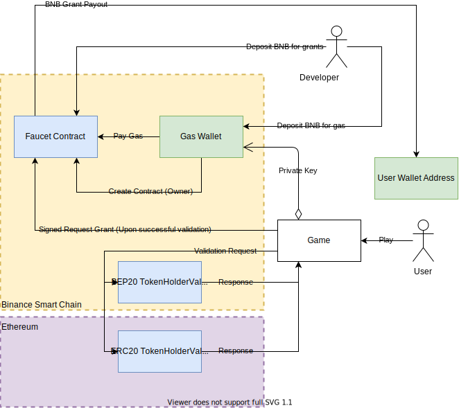

# Game Faucet
This is an entry for OP Game's [Gitcoin Round 10 bounty](https://gitcoin.co/issue/alto-io/gr-10/1/100025933). 

## Requirements
-  Unity 2020.1+
-  [Eth Brownie](https://github.com/eth-brownie/brownie)

## Technical Overview

### Whitelisting/Validation
To qualify for faucet use, users can be required to own a certain amount of tokens on either [Ethereum](https://ropsten.etherscan.io/address/0xBD2231994722D8a47244C4166Bc6Ac4bF8Bbc110) and/or [Binance Smart Chain](https://testnet.bscscan.com/address/0x926A513fdd63e1010e6C0627EB12204ADA45d550) network (among other EVM chains). During development, you can run the [minting brownie script](Brownie/scripts/deployment_test_mint.py) to grant yourself enough tokens.  
You can view example validators [here](https://ropsten.etherscan.io/address/0x78F459703e3682F79F7e4504874Ea8850226764d) & [here](https://testnet.bscscan.com/address/0x08157968B5eE8B421C9cBE241906b6b9D831DBEC)

### Deployment Layout
  
The way to run validation/gate-keeping is via the game application itself, since it is network agnostic. The validation happens on-chain with [TokenHolderThresholdValidator](Brownie/contracts/BadgerValidation.sol) contracts. BSC contracts can't directly call Ethereum contracts, so we have the game independently call each network's validator contracts. All validators are required to succeed before granting rewards. These validators simply check if you have enough of a particular token to qualify for the faucet (aka, you meet the threshold of tokens held). You can deploy a faucet without validators; this feature is entirely optional.

### Token Grant Calculation
You can specify the maximum payout amount when creating the smart contract instance on the blockchain. In this current template, the game design has a variable score and total where `score <= total`. The difference between score and total form the ratio that is factored into the max payout:
```
FinalPayout = (Score/Total) * MaxPayout
```

> Due to how fixed point math works in EVM, [the actual implementation](https://github.com/kilogold/BadgerDAO/blob/c711033d526fa48a5fe2d55c356d150b98932592/Contracts/Faucet.sol#L117) in Solidity is refactored.

### Game To Smart Contract Config
Once the smart contract has been manually deployed, the game must be built with the updated smart contract info:

 1. Mainnet/Testnet infura API address.
 2. Block explorer base address.
 3. Faucet smart contract address.
 4. Designated gas wallet address to cover expenses.
 5. Designated gas wallet private key to sign faucet grant transactions.
 > Needless to say, don't save the production private key into the project. You should only enter it manually prior to building the WebGL project.


## Limitations / Pending Improvements

### Game only runs on Chrome
I'm not exactly a web dev so I had to rely on miscelaneous tutorials to get the WebGL properly bootstrapped with Web3 plugins such as Metamask. Brave Browser doesn't work, for example. The Metamask button on the start screen has only worked when running on Chrome with Metamask being the sole Web3 provider installed. This is likely the culprit: https://medium.com/valist/how-to-connect-web3-js-to-metamask-in-2020-fee2b2edf58a 

### Instant Replay Vulnerability
After playing a session (win or lose), the player can bypass the retry delay period simply by reloading the page immediately. A user could do this consecutively to illegitimately boost their rewards, potentially draining the faucet. This happens because time tracking for each player is done via block timestamps in Solidity. The delay period for any player is only updated on the next block. The solution here is to either:
- Query the mempool to validate whether a player has pending payouts (including zero amounts).
- Centralize the deployment by saving some of the game session data on a persistent backend, possibly even the website's own database.

### Overdraft grant transaction failure
There may be multiple players interacting with the faucet simultaneously. Because we only check for balance before starting a game, the faucet may become depleted by another player's payout before your game ends. When requesting your payout, the transaction will fail because there is not enough balance remaining. Similar to above, the solution here is to either:
- Query the mempool for pending payouts and pre-calculate the maximum collective payout to determine if there is enough for a 100% payout game session.
- Centralize the deployment by saving some of the game session data on a persistent backend, possibly even the website's own database.

## Examples
The project includes an example scene [Assets/Faucet/Demo.unity] where you can preview basic functionality.


For a full-integration demonstration, see the [Coin Catch](https://github.com/kilogold/gr10-OP_Arcade) game repository.
